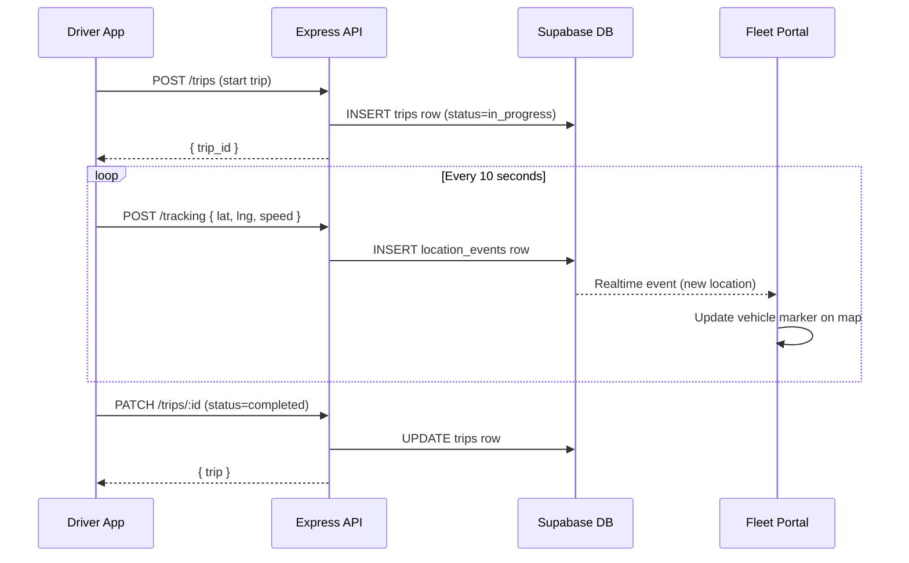
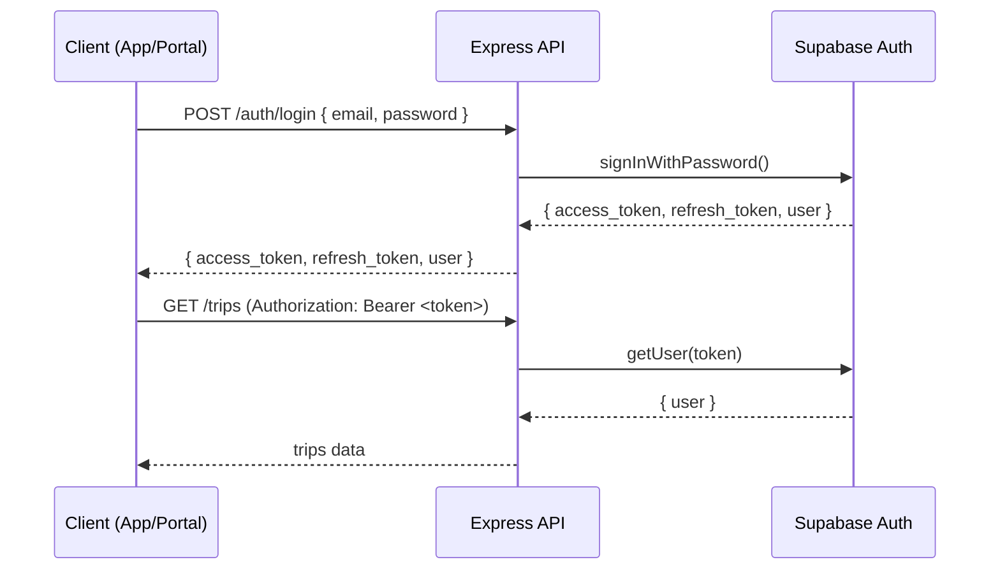

# System Architecture

## Overview

```
┌─────────────────────────────────────────────────────────────────┐
│                         Cruzonic Platform                       │
│                                                                 │
│  ┌──────────────┐        ┌──────────────────┐                  │
│  │ Driver App   │        │  Fleet Portal    │                  │
│  │ React Native │        │  React (Vite)    │                  │
│  │ iOS/Android  │        │  Web Browser     │                  │
│  └──────┬───────┘        └────────┬─────────┘                  │
│         │ HTTPS REST              │ HTTPS REST + Realtime      │
│         ▼                         ▼                             │
│  ┌──────────────────────────────────────────┐                  │
│  │          Express API Server               │                  │
│  │          Node.js / TypeScript             │                  │
│  │  ┌──────────┐  ┌──────────┐  ┌────────┐ │                  │
│  │  │  Auth    │  │  Trips   │  │Tracking│ │                  │
│  │  │ module   │  │  module  │  │ module │ │                  │
│  │  └──────────┘  └──────────┘  └────────┘ │                  │
│  └───────────────────────┬──────────────────┘                  │
│                          │ supabase-js (service role)          │
│                          ▼                                      │
│  ┌──────────────────────────────────────────┐                  │
│  │              Supabase Cloud               │                  │
│  │  ┌──────────────────┐  ┌──────────────┐  │                  │
│  │  │  PostgreSQL DB   │  │  Auth        │  │                  │
│  │  │  (tables + RLS)  │  │  (JWT)       │  │                  │
│  │  └──────────────────┘  └──────────────┘  │                  │
│  │  ┌──────────────────┐  ┌──────────────┐  │                  │
│  │  │  Realtime        │  │  Storage     │  │                  │
│  │  │  (location feed) │  │  (files)     │  │                  │
│  │  └──────────────────┘  └──────────────┘  │                  │
│  └──────────────────────────────────────────┘                  │
└─────────────────────────────────────────────────────────────────┘
```

## Data Flow — Trip Tracking



## Authentication Flow


