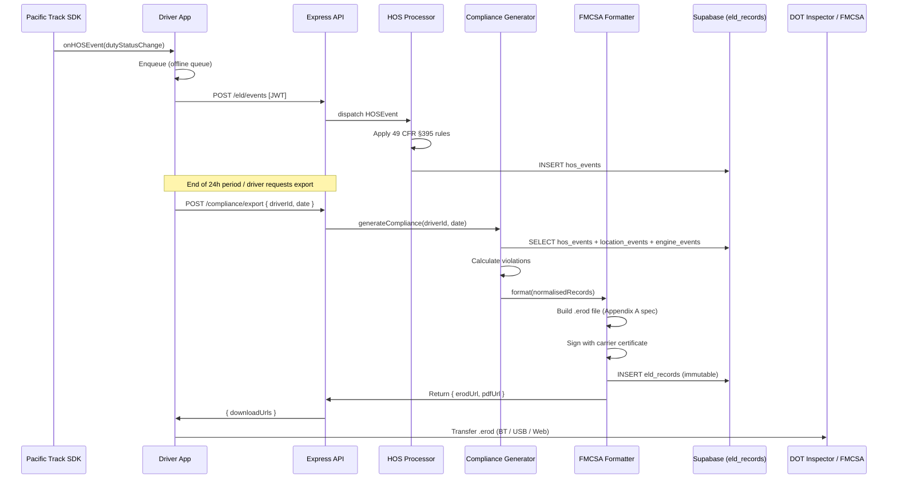

# FMCSA Compliance Output Specification

How Cruzonic generates, validates, and transfers FMCSA-compliant ELD records as required by 49 CFR Part 395, Subpart B and Appendix A.

---

## Overview

The **Compliance Output Generator** is a backend service module responsible for:

1. Collecting all HOS events, location records, and engine data for a given driver and date range
2. Applying federal HOS rules to identify violations
3. Formatting records per the **FMCSA ELD Technical Specification (v1.1.0)**
4. Signing and storing the output in the immutable ELD Records Store
5. Delivering the output via three FMCSA-approved transfer methods

---

## ELD Output File Format (`.erod`)

The `.erod` file is a UTF-8 plain-text file with pipe-delimited (`|`) fields. It conforms to **49 CFR Part 395, Appendix A to Subpart B**.

### File Structure

```
[File Header]
[Driver Information]
[CMV (Vehicle) Information]
[ELD Events — one line per event]
[Malfunction and Diagnostic Events]
[Unidentified Driver Profile]
```

### Section Definitions

#### File Header

```
HDR|<eld-registration-id>|<file-version>|<creation-datetime-utc>|<timezone-offset>|<total-event-count>
```

| Field | Example | Description |
|-------|---------|-------------|
| ELD Registration ID | `PACTRKV1` | FMCSA-assigned device identifier |
| File Version | `1.1.0` | ELD Technical Spec version |
| Creation Datetime | `20240612T180000Z` | ISO 8601 UTC |
| Timezone Offset | `-0700` | Driver's home terminal timezone |
| Total Event Count | `48` | All event records in file |

#### Driver Information

```
DRV|<driver-id>|<last-name>|<first-name>|<cdl-number>|<cdl-state>|<carrier-dot>|<carrier-name>|<home-terminal-addr>|<codriver-id>
```

#### CMV (Vehicle) Information

```
CMV|<power-unit-number>|<vin>|<license-plate>|<plate-state>|<trailer-1>|<trailer-2>
```

#### ELD Event Record

Each duty-status change or auto-generated event produces one record:

```
ELD|<event-seq>|<event-type-code>|<event-sub-type>|<origin-code>|<status-code>|<datetime-utc>|<lat>|<lon>|<location-desc>|<engine-hours>|<engine-miles>|<odometer>|<driver-id>|<codriver-id>|<cmv-power-unit>|<malfunction-code>|<annotation>|<checksum>
```

| Field | Codes / Values |
|-------|---------------|
| Event Type | `1` = duty status change, `2` = intermediate log, `3` = change in ELD indication, `4` = driver login/logout, `5` = CMV's engine power up/down, `6` = malfunction/diagnostic |
| Duty Status | `1` = OFF duty, `2` = Sleeper Berth, `3` = Driving, `4` = On-Duty not driving |
| Origin Code | `1` = auto-generated, `2` = driver, `3` = other user, `4` = unidentified driver |

#### Malfunction & Diagnostic Events

```
MAL|<datetime-utc>|<code>|<type>|<indicator>|<driver-id>|<cmv-power-unit>
```

Malfunction codes: `P E T L R S O`
Diagnostic codes: `1 2 3 4 5 6`

---

## HOS Rule Engine

The Compliance Output Generator applies the following rule sets, selectable per driver based on their exemption profile:

### Property-Carrying Drivers (Standard)

| Rule | Limit |
|------|-------|
| Driving limit | 11 hours after 10 consecutive hours off |
| On-duty window | 14-hour on-duty period |
| Rest break | 30-minute break after 8 cumulative driving hours |
| Weekly limit (7-day) | 60 hours in 7 consecutive days |
| Weekly limit (8-day) | 70 hours in 8 consecutive days |
| Restart | 34-hour restart resets weekly cycle |

### Short-Haul Exemption (§395.1(e))

Applies when driver operates within 150 air-miles of normal work reporting location and returns within 14 hours. ELD not required; timecards acceptable.

### Adverse Driving Conditions (§395.1(b))

Grants up to 2 additional driving hours when unexpected adverse conditions are encountered. Must be annotated in the event record.

### Violation Types Generated

```ts
type HOSViolation =
  | 'DRIVING_LIMIT_EXCEEDED'          // > 11h driving
  | 'ON_DUTY_WINDOW_EXCEEDED'          // > 14h on-duty window
  | 'BREAK_VIOLATION'                  // drove > 8h without 30-min break
  | 'WEEKLY_LIMIT_EXCEEDED'            // > 60/70h weekly
  | 'INSUFFICIENT_OFF_DUTY'            // < 10h consecutive off-duty
  | 'FALSIFICATION_SUSPECTED'          // engine data conflicts with HOS
  | 'UNASSIGNED_DRIVING_TIME';         // driving detected with no logged driver
```

Each violation is attached to the relevant ELD event record and surfaced in:
- The Fleet Portal violation dashboard
- The exported PDF log (annotated in red)
- The `.erod` file (as event annotations)

---

## Output Delivery Methods

FMCSA requires that ELD records be transferable to a roadside inspector via at least two of the following:

### Method 1 — Telematics Transfer (Web Services)

```
Driver app / Portal ──► POST https://dataqs.fmcsa.dot.gov/ELD  (production)
                    ──► POST https://dataqs.fmcsa.dot.gov/ELD/test (testing)

Headers:
  Content-Type: application/octet-stream
  X-ELD-Registration-ID: PACTRKV1
  Authorization: Bearer <fmcsa-api-key>

Body: .erod file contents (signed, compressed)
```

### Method 2 — Bluetooth Transfer

The driver app exposes the ELD output file over a Bluetooth RFCOMM profile. The DOT inspector's official inspection app connects and pulls the file directly from the device. The Pacific Track SDK handles the BT transfer handshake.

### Method 3 — USB Transfer

The ELD device exposes a USB mass-storage profile. Inspectors can read the `.erod` file directly from the device. The SDK copies the latest file to the device's USB-accessible partition after each generation.

### Method 4 — On-Screen Display (backup)

If transfer methods fail, the driver app renders a read-only HOS display that the inspector can review on-screen. This is the fallback mandated by 49 CFR §395.26(d).

---

## Compliance Pipeline — Sequence Diagram



---

## ELD Records Retention

Per **49 CFR §395.8(k)**, ELD records must be retained for **6 months**. The Cruzonic `eld_records` table:

- Is append-only (no UPDATE or DELETE via application layer)
- Has a PostgreSQL row-level check preventing modification
- Has automated Supabase scheduled job to archive records older than 6 months to cold storage (Supabase Storage)
- Records include a SHA-256 hash of the file content for tamper evidence

---

## Testing Against the FMCSA ELD Validator

FMCSA provides a validation tool for `.erod` files. To test:

```bash
# 1. Generate a test output file
cd backend
npm run compliance:test-export -- --driverId=test-driver --date=2024-06-01

# 2. Submit to FMCSA test endpoint
curl -X POST https://dataqs.fmcsa.dot.gov/ELD/test \
  -H "Content-Type: application/octet-stream" \
  -H "X-ELD-Registration-ID: PACTRKV1" \
  --data-binary @./exports/test-driver-2024-06-01.erod

# 3. Check response for validation errors
```

See `/docs/fmcsa-test-checklist.md` for the full acceptance test matrix.

---

## FMCSA Registration Requirements

Before deploying to production, the ELD device (Pacific Track hardware) must be:

1. **Registered on the FMCSA ELD list** at fmcsa.dot.gov/hours-service/elds/eld-provider-registration
2. **Self-certified** by the technology provider
3. **Assigned an ELD Registration ID** (used in file headers and transfer handshakes)

The carrier (fleet operator) must:
1. Ensure all CMVs required to use ELDs are equipped
2. Train drivers on ELD use and malfunction reporting
3. Retain paper logs for 8 days after ELD malfunction
